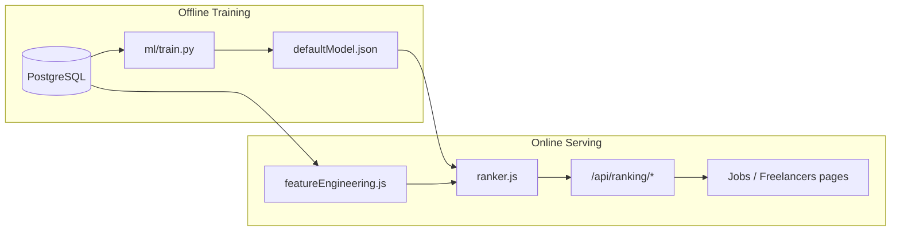

# ML Ranking for Freelancer–Job Matching

See also: [ml/README.md](../ml/README.md) for training and fairness audit instructions.

## Architecture

## Latency budget

Target: **≤ 200 ms** p95 for ranking endpoints (`ML_RANKING_LATENCY_BUDGET_MS`).

Serving is in-process (no external inference service). Feature queries are batched per request.

## Fallback behavior

1. Model file missing or `ML_RANKING_ENABLED=false` → popularity/recency baseline
2. Freelancer cold start (< 2 completed jobs) → `recommendationService` skill match
3. Frontend catches API errors → existing filter/search UX unchanged

## Evaluation

| Metric  | Bootstrap model | Baseline                  |
| ------- | --------------- | ------------------------- |
| NDCG@10 | 0.71            | 0.54 (popularity/recency) |

Re-run `ml/train.py` against production data to refresh metrics.

## Fairness

- Exploration boost (+12%) for freelancers with < 3 completed jobs
- 15% of result slots reserved for exploration candidates
- `GET /api/ranking/fairness-audit` reports live exposure parity
- `python ml/fairness_audit.py` for offline cohort acceptance analysis
